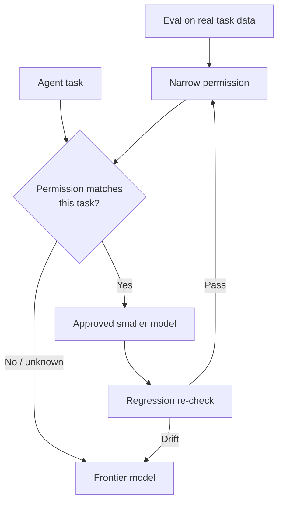

# model-eval-gate — a delegation policy engine for AI agents

<!-- portfolio-status -->
**Status:** Reference implementation — extracted from a private production GTM system; tenant data, provider adapters, and company-specific policy stay private. · **Layer:** Quality & policy enforcement · **[Portfolio map ›](https://github.com/kkrlstrm)**

> **Agents can plan freely. They cannot downgrade freely.**

model-eval-gate turns observed agent work and real evaluations into **versioned delegation
policy** that runtimes such as OpenClaw can enforce.

**Built for teams operating persistent, multi-agent, scheduled, or high-volume agent
workflows** — where an unevaluated model downgrade can quietly become production behaviour.
If you are running a single-model chatbot, you do not need this.

**Cheaper is not a permission.**



**Illustrative output** — the three outcomes it produces (fictional data; see [Data policy](#data-policy)):

```
$ meg workload list
   9,400  supplier-page-digest    billing=api           eligible=yes
     310  claim-summary-draft     billing=subscription  eligible=NO
           └─ subscription-billed: marginal cost is ~$0, so routing it would save $0

$ meg eval scaffold supplier-page-digest      # → a reviewable eval spec; a human approves the resulting policy
$ meg observe coverage
   3 provider requests did NOT come through the recorder — something bypassed the gate
```

## Where it sits

| layer | decides |
|---|---|
| **Agent runtime** — OpenClaw, Hermes, your own loop | *what work to do* |
| **Gateway** — OpenRouter, LiteLLM | *how the call executes* — provider, fallback, cost, throughput |
| **model-eval-gate** | *whether that work may be delegated to a smaller model at all* |

These compose. It is not a replacement for a gateway or an eval platform: those execute
calls and measure quality. This governs the **decision to delegate**, and keeps that
decision maintained after it is made. See [integrations/](integrations/) — the OpenClaw
plugin is enforcing today.

## Built for agent runtimes

OpenClaw, Hermes and other frameworks decide **what work to perform**. model-eval-gate
supplies the policy answer *before* they select a smaller worker: **approved**, **frontier
required**, or **insufficient evidence**.

An adapter is a thin translation over one decision function
([`meg/policy.py:decide()`](meg/policy.py)) — adapters hold no policy of their own, so a
new runtime cannot ship a slightly different interpretation of the rules.

**OpenClaw — enforcing today.** `before_model_resolve` runs before the session model is
resolved and may return `{ providerOverride, modelOverride }`; returning nothing means no
override — which maps onto this policy exactly, because a refusal *is* "return nothing."

```ts
// Source install — import from a checkout. There is no published package export
// for this path yet (see Honest limits), so a bare specifier would not resolve.
import { register } from "./path/to/model-eval-gate/integrations/openclaw/index.ts";

export default (api) =>
  register(api, {
    requireFullMetadata: true, // unattended: an unevidenced constraint refuses
    workloadMap: {
      "nightly-enrichment": { mode: "extract-bulk", meta: { rows: 5000, single_row_decision: false } },
    },
  });
```

It only overrides a turn with **the model named by an approved mode**. It never selects a
model on price and never substitutes an unapproved one. (It does not compare that model
against OpenClaw's configured default, so it cannot claim the override is always a
*downgrade* — only that the destination was approved for this workload.)

**What it does today, precisely:** it returns `modelOverride` for approved work, **logs** its
policy decisions (console or a caller-supplied `log`, not the persistent hash-chained audit
log), and emits usage diagnostics. It does **not** yet persist OpenClaw calls
into the telemetry store, and full provider-ledger reconciliation remains a runtime
integration step. A `nudge` currently **surfaces a warning to the runtime/operator** — it is
not injected into the prompt; that needs a `before_prompt_build` integration. And because
OpenClaw's `providerOverride` takes a provider *name*, a multi-field provider pin
(order/fallbacks/quantization) is reduced to its first entry, so pin fidelity is weaker here
than through the Python path.

**Hermes — advisory only, and it says so.** Hermes' `pre_llm_call` hook currently has its
result treated as user-message context, so a plugin cannot cleanly override the model;
doing it today means monkey-patching the agent loop, which is brittle across releases
([upstream issue](https://github.com/NousResearch/hermes-agent/issues/23739)). The adapter
therefore **decides and records but does not enforce**, rather than monkey-patching to look
like it works. It becomes enforcing when the upstream hook can return an override, with no
policy change.

**Anything else** — implement four capabilities (pre-call hook, a way to tag work, model
override, post-call usage) and the adapter is ~20 lines. See
[integrations/](integrations/).

## The failure mode

The dangerous delegation bug isn't an outage. It's a **quiet downgrade.**

A cheap model works beautifully on 80% of a task shape, gets generalized into "use this for extraction / classification / summarization," and then starts handling the 20% where it fails silently. Nobody notices until a human acts on a single wrong row, a customer-facing draft hallucinates an entity, or quality slips because the provider behind a model ID changed underneath you.

model-eval-gate prevents that failure mode by making delegation **explicit, narrow, evidenced, and reversible.**

## Why this isn't a router

"Model routing" is the wrong comparison set. LiteLLM / OpenRouter route the *call* — provider selection, cost and latency, fallback. model-eval-gate sits one layer up and decides whether the call is **allowed to be delegated at all.**

> OpenRouter can route the call.
> model-eval-gate decides whether the call is allowed to be delegated in the first place.

Three ideas do the work:

1. **Refusal is the feature.** Most routers optimize "where should this go?" This says: unless a task has earned a mode, it doesn't go anywhere cheaper. Off-allowlist and retired modes are refused, not silently downgraded.
2. **Modes are named for the task, not the model.** `extract-bulk`, never `qwen`. A mode named after a model becomes a vibes-based lookup table; a mode named after a task shape forces you to describe what you're actually doing — and makes misuse obvious.
3. **Eval verdicts become production policy.** `routes.json` is the single source of truth — purpose, `use_when`, `do_not_use_when`, evidence reference, verified date, provider pin — read live by both the CLI and the Python port.

## Not an eval framework

model-eval-gate doesn't replace your eval platform ([Ori Eval](https://openrouter.ai/blog/announcements/ori-eval), Promptfoo, Braintrust, Harbor, your own harness). It **consumes eval decisions and keeps them honest:**

- an **initial eval** decides whether a mode may exist;
- a **regression spec** checks whether that permission is still valid.

The included harness is policy *maintenance*, not a competing eval product.

> **Ori Eval picks the winner. This decides whether there should be one — and whether that is still true next month.**

That distinction is easy to lose, so it is worth making concrete. Ori's documented scheduled
workflow is: re-run monthly, and when a model scores better than the incumbent, **open a PR
you merge**. For a coding agent's default model that is a good default. For a *governed mode*
it is the failure this repo exists to prevent — a model swap merged on a single run, with no
`do_not_use_when`, no pass^k consistency check, no provider pin, and no dated record of what
was replaced or why. **Cheaper is not a permission; neither is "scored better."**

They compose, and [`integrations/ori/`](integrations/ori/) is the seam:

```bash
npm run ori status                              # is Ori usable here — and what works if it isn't
npm run ori emit   -- --mode support-triage     # a governed spec  → a runnable Ori *.eval.ts
npm run ori import -- --mode support-triage     # an Ori run       → a PROPOSAL, never routes.json
```

`import` writes a frozen regression spec and a mode **stub** whose `use_when` /
`do_not_use_when` are deliberately left `TODO` — the negative constraint comes from a human
reading the failures, and no eval tool can infer it. It also states what the run does *not*
establish: pass^k, a provider pin, and the subscription counterfactual.

**Ori is optional.** Both directions are pure file operations, and every spec stays runnable
by this repo's own harness without it. What Ori adds is the half this harness deliberately
does not do — running a real agent loop to *produce* a trajectory.

## Where the modes come from (v2)

v1 assumed you already knew which task shapes to eval. Most people don't — and the model
catalog can't tell you, because the catalog doesn't know what you do. So v2 adds the half
that comes *before* the gate:

```
observe ──▶ cluster ──▶ propose ──▶ scaffold ──▶ validate ──▶ run ──▶ gate ──▶ maintain
   │           │           │           │            │          │        │         │
harness     workload    candidate     eval       grader     bake-off  routes  regression
adapters    classes     slate from    spec +     sanity     vs        .json   + staleness
+ call                  the live      samples    check      control           + dead-mode
recorder                catalog                                                feedback
```

Routing tools generally start from a model catalog and optimise the call: which provider,
what fallback, what cost. That is a real and different job, and this complements it.
Starting from **observed work** instead makes the first question *"what do I actually do,
and which parts are even eligible to move?"* — and eligibility is a property of the task,
not of the price list.

```bash
meg observe ingest        # read Claude Code + Codex sessions you have ALREADY run
meg observe sync          # pull the provider's daily spend rollup
meg observe coverage      # is anything reaching the provider around the gate?
meg workload list         # what work exists, and what may move
meg workload propose supplier-page-digest    # candidates ranked on YOUR token profile
meg eval scaffold supplier-page-digest       # a reviewable eval spec
```

See it end-to-end on invented data — no setup, no key:

```bash
python3 examples/fictional_workload.py
```

### Telemetry: both harnesses, one schema

Two coding agents, two mechanisms, because they expose telemetry differently and pretending
otherwise loses data:

| harness | mechanism | why |
|---|---|---|
| **Claude Code** | lifecycle HTTP hooks + local transcript JSONL | hooks fire for every tool; the transcript path also works **retroactively**, so you get a workload picture from past sessions without having configured anything first |
| **Codex** | tail the append-only rollout JSONL under `~/.codex/sessions/**` | Codex hooks fire only for shell commands, so a hook-based reader silently misses edits, MCP calls and sub-agents |

Both land in one `work_events` table, so everything downstream is harness-agnostic. This
mirrors the split proven by [cc-logger](https://github.com/kkrlstrm/cc-logger) and
[codex-logger](https://github.com/kkrlstrm/codex-logger).

**Only the *shape* of a call is stored, never its content.** Commands are reduced to an
argv0 and a script name, prompts to a length and a fingerprint. These databases get shared
when someone asks for routing help; prompts and arguments would carry customer data and
credentials into that conversation.

### The counterfactual nobody else computes

If a call runs inside a Claude Code or Codex session on a subscription, the frontier
model's marginal cost is **$0**. Routing it elsewhere saves nothing — it buys rate-limit
headroom and throughput, which are real but are not dollars. The saving is real only for
work that would otherwise be **API-billed**.

So `billing` is recorded per call, and the counterfactual says so out loud:

```
supplier-page-digest   frontier $420.18 → candidate $11.81   ratio 35.6x
                       DOLLARS SAVED $408.37   ← real saving: this work is API-billed

claim-summary-draft    frontier  $12.55 → candidate  $0.29   ratio 43.5x
                       DOLLARS SAVED   $0.00   ← subscription-billed, marginal cost ~$0
```

A gate that can't tell these apart reports savings that don't exist.

### Storage

SQLite by default (`~/.model-eval-gate/meg.db`, zero setup). Point `MEG_DB` or `--db` at a
`postgresql://` DSN to co-locate with an existing telemetry database — same schema, same
code path. The Postgres backend is covered by tests you can run yourself:

```bash
createdb meg_pg_test
MEG_TEST_PG="postgresql://$(whoami)@localhost:5432/meg_pg_test" python3 test/test_pipeline.py
dropdb meg_pg_test
```

The observe / cluster / propose / scaffold stages are **stdlib-only**; `psycopg2` is an
optional extra (`pip install 'model-eval-gate[postgres]'`) and `requests` is needed only by
the Python port's live-call path.

### Presets are hypotheses, not verdicts

The bundled modes were verified on someone else's data. Shipping them as verdicts would
violate the project's own founding rule, so a preset is **a starting hypothesis you confirm
on your own data**, not a permission you inherit. Your first regression run is your first
eval.

**Current state, stated plainly:** 2 of the 6 bundled modes ship a frozen regression spec.

| mode | regression spec |
|---|---|
| `filter-auto-reply` | ✅ `eval/regression/auto-reply.json` |
| `extract-accurate` | ✅ `eval/regression/extract-fields.json` |
| `extract-bulk` | ❌ — shares the extraction schema; needs its own throughput-shaped gold set |
| `digest-longcontext` | ❌ — needs an LLM-judge grader |
| `lint-code` | ❌ — needs an LLM-judge grader |
| `extract-multimodal` | ❌ — needs an image corpus |

A mode without a spec is a **hypothesis with no maintenance behind it**. Treat those four
as "someone else measured this once"; confirm before relying on them. Contributions of
specs (with fictionalised corpora) are the most useful PR you can send.

## Honest limits

This is a **reference implementation** with a fail-closed wrapper and a governance loop —
a *delegation policy engine*, not a universal agent control plane. That is the destination,
and reaching it needs three things this does not yet have: a hardened egress boundary,
persisted framework telemetry, and broader adapters. Eight limits, all reported by the tool
itself (`meg gate check`, `meg observe coverage`, `npm run ori status`):

1. **Enforcement covers calls that pass through it.** A tool shelling out to a provider, or
   a sub-process with its own API key, bypasses it. That is why coverage reconciliation
   exists rather than being optional.
2. **Missing caller metadata nudges by default; it does not refuse.** A constraint nobody
   supplied evidence for is *unchecked*, not satisfied — the call proceeds and the caller is
   told why that is questionable. Pass `posture="unattended"` (or
   `require_full_metadata=True` / `requireFullMetadata: true`) to make it a refusal, which
   is the right setting whenever nobody is reading the warning.
3. **4 of 6 bundled modes declare no machine-checkable constraints.** For those the gate
   checks the mode name and nothing else; eligibility lives in prose that no runtime reads.
4. **4 of 6 bundled modes have no regression spec.** A mode without one is a verdict nobody
   re-measures.
5. **The plugin is source, not a published package.** `package.json` declares no `exports`,
   `main` or build step, so the adapter is imported from a checkout rather than installed
   as `model-eval-gate/integrations/openclaw`. Packaging it is a real step, not a rename.
6. **The OpenClaw adapter enforces but does not yet reconcile.** It returns `modelOverride`
   and records decisions; it does not persist OpenClaw calls to the telemetry store, does
   not inject nudge text into the prompt, and reduces a multi-field provider pin to its
   first provider name. Each is a runtime integration step, not a policy gap.
7. **This harness cannot produce a trajectory.** It issues a single model call and runs no
   agent loop, so trajectory graders score against a trajectory *recorded* in the spec, or
   one supplied by an adapter that does run an agent. Assert on one, don't generate one.
8. **The Ori importer reads an undocumented record shape.** Ori documents that runs land in
   `.ori/eval/history.jsonl`, but not the per-record fields. The importer probes several
   plausible names, leaves what it cannot find *absent rather than defaulted*, and reports
   unparseable or unattributable records as blockers — so a schema change degrades to "I
   could not attribute these" rather than a confident wrong verdict. It is still a shape
   this repo inferred, not one that was promised.

## Scope: a gate, not a sandbox

Be clear-eyed about the boundary. **model-eval-gate is a fail-closed gate for calls that go *through* it** — the CLI or the Python port. It is **not** a sandbox or a network-level policy boundary: an agent, service, or script that calls OpenRouter (or a provider) directly bypasses it entirely.

To make it a real control plane rather than a governed helper, **make it the only model-egress path** — e.g. run the calling code without provider API keys in its environment and expose only this wrapper, or put it behind an egress proxy that blocks direct provider domains. Within that boundary, the guarantees hold: unknown/retired modes are refused before any call, task metadata is checked against machine-readable constraints, and the policy file is validated on load (a malformed `routes.json` refuses everything rather than routing on garbage).

## The lifecycle

```
   candidate cheap model
          │
          ▼
   eval on your real task data
          │
          ▼
   mode earns a narrow permission
          │
          ▼
   routes.json   ← the allowlist / single source of truth
          │
          ▼
   CLI + Python enforce it   ← refuse everything off-allowlist
          │
          ▼
   regression re-checks for drift
          │
     ┌────┴─────┐
   pass        fail
   keep mode   retire with a dated reason
```

## Engineering integrity

Not the buyer value — the reason to trust the buyer value. Each row is a bug that
shipped silently before the guard existed.


| guardrail | what it prevents |
|---|---|
| `meg observe coverage` | a script calling the provider **around** the gate, on a model nobody evaluated |
| hard filters before price ranking | a cheaper model that can't meet the output contract being ranked at all |
| negative/absent price → infinite | router pseudo-models publishing `-1` and ranking first at *minus* $108M |
| free tiers excluded by default | a `$0` rank winning every comparison, on endpoints that rate-limit so hard the eval doesn't predict production |
| `validate()` before any spend | a grader that condemns every arm because it's measuring **itself** |
| cross-family judge panels | a judge inflating its own family's arm (measured at **+0.32** on a 1–5 scale) |
| unknown stakes ⇒ treated as high | a cheap model quietly making per-row decisions nobody audited |
| **graduated actions** — `monitor` / `nudge` / `refuse` / `block` | a binary gate having only "yes" and "no": `monitor` rolls a mode out by recording what it *would* have done; `nudge` proceeds but hands the model the reason it is questionable |
| **posture** — attended vs unattended | "nobody objected" being read as evidence at 3am. Attended nudges on an unproven constraint; unattended refuses |
| **hash-chained audit log** | a decision quietly reclassified after something went wrong — `meg.audit.verify()` locates the first edited line |
| `gates/verify_no_real_data.py` | this repo breaking its own "ships no real data" promise, which until it existed was enforced by nobody |
| pre-commit hook, scanning the **index** | a credential reaching history at all — CI catches a leak before it merges, but not before it exists, and a key in a commit needs a rotation rather than an edit |
| `gates/verify_doc_refs.py` | a doc telling an agent to run a file that no longer exists, so it improvises the thing the helper prevented |
| **vacuous-emit refusal** (`ori emit`) | exporting an eval whose only surviving assertion is `toComplete()` — green whatever the model says. The first spec emitted to Ori produced exactly that, because every one of its graders was a gold comparison Ori's API cannot express |
| **unmapped graders reported, never approximated** | an exported eval silently checking something *weaker* than the spec it came from, and a green run there being read as evidence about the mode |
| **absent trajectory fails both ways** | a spec advertising behavioural coverage it never had — `toolNotCalled` "passing" because nothing was recorded is not proof the tool went uncalled |
| `COALESCE` merge on every upsert | a partial write blanking the columns the other half established — a call record arrives in two halves and neither carries the other's fields |

## Install

```bash
git clone https://github.com/kkrlstrm/model-eval-gate && cd model-eval-gate
pip install -e .          # the `meg` pipeline (stdlib-only)
npm install               # the TS gate/CLI + regression harness
npm run hooks:install     # pre-commit gates (~130ms, repo-local)
cp .env.example .env      # add your OPENROUTER_API_KEY
```

`hooks:install` sets `core.hooksPath` to the tracked `.githooks/` directory — nothing global
is touched, and the hooks arrive with a clone instead of living only in one machine's
untracked `.git/hooks`. It runs the two repo gates on **staged content** before every
commit. Bypass with `git commit --no-verify`; CI runs the same gates either way.

The `meg` pipeline needs Python 3.10+ and no third-party packages. The TS gate needs Node
18+. An [OpenRouter](https://openrouter.ai) key is required for live calls and the model
catalog; `meg observe ingest`, `meg workload list` and grader validation all work offline.

`meg observe sync` additionally needs `OPENROUTER_MANAGEMENT_KEY` — the daily-spend
endpoint rejects an inference key with a 403, and it only retains **30 days**, so schedule
it daily or you lose history permanently.

## Use

**As a CLI** (the enforcer):

```bash
npx tsx src/cli.ts help                          # the current allowlist, with verified dates
npx tsx src/cli.ts explain extract-bulk          # one mode's purpose, boundaries, evidence, pin, constraints
npx tsx src/cli.ts extract-bulk "<prompt>" --rows 5000   # runs — earned mode AND constraints satisfied
npx tsx src/cli.ts extract-bulk "<prompt>" --rows 3      # REFUSED — mode requires min_rows: 50
npx tsx src/cli.ts extract-multimodal "Read this roster" --image page.png
npx tsx src/cli.ts anything-else "..."           # refused — no earned mode
```

Task-eligibility flags (`--rows N`, `--stakes low|medium|high`, `--input text|image`, `--single-row`, `--human-reviewed`) are checked against each mode's `constraints` — so a mode can't be misused on a task it wasn't proven for, not just misnamed.

**From Python** (the same allowlist, no Node required):

```python
from src.router import text_call, vision_call, can_delegate
if can_delegate("extract-bulk", {"rows": 5000, "single_row_decision": False})["ok"]:
    text, usd = text_call("extract-bulk", "Extract fields:", big_text)
text, usd = vision_call("extract-multimodal", "Read the phone numbers.", "page.png")
# an off-allowlist mode raises ValueError — same refusal as the CLI
```

**Validate the policy offline** (no key, CI-friendly) and inspect a mode:

```bash
npx tsx src/check.ts        # validate routes.json + every regression spec (or: python src/router.py check)
npm run typecheck && npm test   # tsc + TS/Python parity tests — all offline
```

## `routes.json` — eval verdicts as policy

One file is the source of truth, read live by both the CLI and the Python port:

```jsonc
{
  "modes": {
    "extract-bulk": {
      "model": "qwen/qwen3-235b-a22b-2507",
      "purpose": "High-volume field extraction whose output feeds aggregate analytics.",
      "use_when": "N > 50 rows AND output is counted/grouped/distributed (not acted on per-row).",
      "do_not_use_when": "An operator reads a single output row and decides from it. ~20% disagreement with the frontier anchor on judgment-laden fields.",
      "evidence_ref": "docs/OBSERVATIONS.example.md 'Eval 1'",
      "verified_date": "2026-05-18",
      "provider": null
    }
  },
  "retired": { "generic-cheap": { "retired_date": "2026-05-18", "reason": "..." } }
}
```

The six modes shipped here are **realistic examples** to show the shape. Replace them with modes your own evals justify. See **[GOVERNANCE.md](GOVERNANCE.md)** for the policy and **[docs/ADDING_A_MODE.md](docs/ADDING_A_MODE.md)** for the workflow.

## Four things that keep the policy honest

### 1. Provider pinning — the eval→prod drift guard

Passing an eval against `model-x` isn't enough if production might hit a different provider, quantization, or serving stack. OpenRouter routes a model ID across providers by uptime and cost unless you say otherwise, and [Anthropic has shown that infrastructure configuration alone can swing agentic eval scores by several points](https://www.anthropic.com/engineering/infrastructure-noise) — sometimes more than the gap between models on a leaderboard. Each mode takes an optional `provider` pin (`{order, only, allowFallbacks, quantizations}`) that both the CLI and the Python port pass on every call, so **production runs against the thing you actually tested.** The regression harness records the served provider so you can set a pin from real data.

### 2. Regression with pass@k / pass^k

Capability evals ("can it do this?") graduate into regression evals ("does it still?"). `eval/regression.ts` re-runs each frozen spec against **the model the allowlist currently routes that mode to** (so a swapped model is caught), over **k trials**, and reports:

- **pass@k** — did at least one of k trials pass (shots on goal)
- **pass^k** — did *all* k trials pass (consistency; the metric that matters for binary-gating / customer-facing modes)
- score + stdev, cost, latency, served provider

It flags **score drift**, **consistency drift**, and **model swap**, and exits non-zero — wire it into CI or a scheduled job.

```bash
npx tsx eval/regression.ts                    # run every spec
npx tsx eval/regression.ts --mode filter-auto-reply --k 5
npx tsx eval/regression.ts --update-baseline  # record current numbers as the new baseline
```

Specs live in `eval/regression/*.json` and ship with a **synthetic corpus** (fabricated leads / email replies with unambiguous gold) so you can `git clone` and run a real regression today. Swap in your own gold sets.

### 3. A three-grader taxonomy

`eval/graders.ts` implements the [three grader kinds from Anthropic's evals guidance](https://www.anthropic.com/engineering/demystifying-evals-for-ai-agents): **code** (deterministic — the default; field-agreement, normalized, enum, numeric-tolerance, array-set, must-not-contain, regex, json-subset), **model** (LLM-as-judge, opt-in), **human** (a recorded verdict frozen into the spec). A regression run separates model-quality drift from `provider_unavailable` / `parse_failure` / `grader_failure`, so a transient outage never looks like a regression.

### 4. Trajectory assertions — grading what the agent *did*

An output grader cannot catch a support agent that issues a refund without ever calling `lookup_order`: the prose is fine, the behaviour is not. Six kinds cover that — `toolCalled`, `toolNotCalled`, `toolSequence`, `mentions`, `costAtMost`, `latencyAtMost`.

**Missing evidence fails.** With no trajectory recorded, `toolCalled` does not pass ("we never saw it call the tool") and `toolNotCalled` does not pass either ("we cannot prove it didn't"). Same rule the gate applies to absent caller metadata: unchecked is not satisfied. Silently passing there would let a spec advertise behavioural coverage it never had — which is worse than having no assertion, because it reads as coverage.

This harness makes a **single model call** and runs no agent loop, so it never observes a trajectory itself. One is either frozen into the spec (`tasks[].trajectory`, recorded from a real run — the same pattern as the human grader) or produced by an adapter that does run an agent, e.g. [`integrations/ori/`](integrations/ori/). That limit is real and stated rather than papered over.

## Layout

```
routes.json              the allowlist — eval verdicts as enforceable policy
src/schema.ts            zod validation of routes + specs (fail-closed on load)
src/cli.ts               the CLI enforcer (Node/tsx) — refuses everything off-allowlist
src/router.py            the Python port — same allowlist, stdlib + requests
src/preflight.ts         machine-checkable constraints → canDelegate(mode, taskMeta)
src/check.ts             offline policy validator (no API) — routes + every spec
eval/harness.ts          k-trial runner: pass@k / pass^k, outcome taxonomy, real cost
eval/graders.ts          the grader taxonomy + buildGrader factory
eval/regression.ts       re-run frozen specs, classify drift, exit non-zero
eval/regression/*.json   frozen specs + synthetic gold
test/                    offline TS+Python parity tests (shared golden fixtures)
GOVERNANCE.md            the policy: a mode requires a passing eval
docs/ADDING_A_MODE.md ·  docs/OBSERVATIONS.example.md
```

## Development

```bash
npm run typecheck    # tsc --noEmit
npm run check        # validate all policy files (offline)
npm test             # TS + Python parity tests (offline)
npm run format       # prettier
npm run ci           # all of the above — the same gate GitHub Actions runs
```

CI (`.github/workflows/ci.yml`) runs the offline gate on every push/PR. The live regression suite needs a key and runs on a schedule, not in CI.

## License

Apache-2.0 © 2026 Kai Karlstrom

## Data policy

This repository ships **no real data**. Every fixture, sample workload, example
observation and preset number is invented — fictional organisations, fictional people,
fictional model ids. Your telemetry stays in your own store (`~/.model-eval-gate/meg.db`
by default) and is never committed here.

If you contribute an eval writeup, generalise it first: the *shape* of the finding is the
useful part, and it travels without your customers' names attached.

---

<!-- portfolio-footer -->
## Where this fits

Part of a portfolio of **governed, AI-native GTM systems** — reference implementations and reusable patterns extracted from a private production stack. In that system this is the eval-backed gate that decides whether a call may be delegated to a cheaper model at all.

**Full portfolio map → [github.com/kkrlstrm](https://github.com/kkrlstrm)**

Works with:
- [cc-logger](https://github.com/kkrlstrm/cc-logger) — observes real delegation usage
- [codex-logger](https://github.com/kkrlstrm/codex-logger) — the Codex half of the same signal